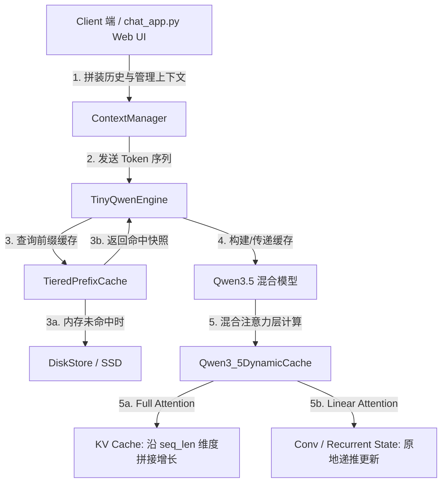

# Qwen3.5 推理引擎设计与优化报告：从 Causal Attention 到两级 Prefix Cache

本报告旨在为大模型推理引擎项目的答辩准备提供系统性、理论性的框架梳理。报告不聚焦于具体的代码行实现，而是从**整体架构设计**、**大模型核心原理**、**各阶段（Phase）核心任务与技术要点**以及**答辩高频问题**四个维度进行深度剖析，协助理清推理引擎的核心机制与优化脉络。

---

## 一、 推理引擎整体架构与设计框架

### 1.1 Qwen3.5-0.8B 混合注意力架构
本项目基于 **Qwen3.5-0.8B** 模型架构实现。与传统纯 Softmax 注意力（如 LLaMA、GPT-3）不同，Qwen3.5 采用了一种**混合注意力机制**（Hybrid Attention），以 **3:1** 的比例交替堆叠两种注意力层：
*   **Full Attention 层（占比 25%）**：每 4 层出现 1 次。采用标准 Softmax 注意力 + RoPE（旋转位置编码）。该层保留了强大的“精确回忆”能力，但需要维护随序列长度线性增长的 **KV Cache**。
*   **Linear Attention 层（占比 75%）**：其余 3 层。采用 **Gated Delta Net** 结构，通过改变注意力计算的结合律，将推理复杂度降低到与序列长度无关。该层维护两个**固定大小的递推状态**（滑动卷积状态 `conv_state` 与记忆矩阵状态 `recurrent_state`），不随序列增长。

> **架构设计的核心优势**：
> 75% 的线性注意力层使得 Qwen3.5 的整体 KV Cache 显存占用**仅为纯 Softmax 模型的 25%**。在超长上下文（如 32K 乃至 256K）时，能实现数倍至十几倍的推理速度提升，且几乎没有推理质量损失。

### 1.2 推理引擎组件结构图
整个推理引擎的模块分工如下：

---

## 二、 大模型核心原理与技术背景

为了应对答辩中关于大模型基本概念的提问，以下整理了本项目涉及的核心原理：

### 2.1 Causal Attention 与 Causal Mask
*   **自回归生成与因果性**：Decoder-only 架构的模型在生成第 $t$ 个 token 时，只能看到前 $t-1$ 个 token，这被称为**因果性（Causal）**。
*   **Causal Mask（下三角掩码）**：在注意力分数矩阵 $\mathbf{Q}\mathbf{K}^\top$ 上施加一个下三角矩阵，将上三角（代表未来 token）的值设为 $-\infty$。经过 Softmax 后，这些位置的注意力权重变为 0，从而阻断信息向未来的泄漏。
*   **KV Cache 的理论前提**：正是因为因果性，**历史 token 的输入状态在后续生成中保持不变**，因此它们对应的 Key（键）和 Value（值）投影向量是一次性决定且恒定不变的。这使得缓存历史上计算过的 K 和 V 变得安全和可行。
*   **为什么不缓存 Query（Q）？**：因为 Query 代表当前时间步的检索意图。在每一步自回归生成中，我们只关心新生成的那个 token 的 $\mathbf{q}_t$，历史的 $\mathbf{Q}$ 在后续计算中绝对不会被再次用到，因此无需缓存。

### 2.2 推理双阶段：Prefill 与 Decode
大模型的一次完整推理生命周期包含两个负载特征迥异的阶段：

| 特征维度 | Prefill（预填充）阶段 | Decode（解码）阶段 |
| :--- | :--- | :--- |
| **任务内容** | 一次性处理用户输入的 prompt，并行计算所有历史位置的表示，建立初始缓存，输出第一个 token。 | 基于已有的缓存，一步一步自回归地生成后续 token，每次前向传播只输入上一步生成的 1 个 token。 |
| **计算维度** | 序列长度 $n$ 较大。隐状态矩阵乘法规模大。 | 输入序列长度恒为 1。 |
| **瓶颈特征** | **计算密集型（Compute-bound）**。算力利用率高，吃满 GPU/CPU 的浮点运算单元（ALU）。 | **访存/带宽密集型（Memory-bound）**。每生成 1 个 token，都必须将整个模型权重及所有历史缓存从内存加载到计算核心中。 |
| **优化核心** | 算力调度、并行矩阵乘法、算子融合。 | 减少模型权重的重复加载、降低缓存大小、提高访存带宽利用率。 |

### 2.3 Linear Attention（线性注意力）代数原理
标准注意力计算为：
$$\mathbf{O} = \text{Softmax}\left(\frac{\mathbf{Q}\mathbf{K}^\top}{\sqrt{d_k}}\right)\mathbf{V}$$
由于外层的 $\text{Softmax}$ 使得 $\mathbf{Q}$ 和 $\mathbf{K}$ 发生非线性耦合，我们必须先计算 $n \times n$ 的注意力分数矩阵，再与 $\mathbf{V}$ 相乘，导致空间和时间复杂度均为 $O(n^2)$。

**线性注意力**去掉了 $\text{Softmax}$（或采用特征映射 $\phi$），利用矩阵乘法的**结合律**改变计算顺序：
$$\mathbf{O} = \phi(\mathbf{Q}) \left( \phi(\mathbf{K})^\top \mathbf{V} \right)$$
1.  **先计算** $\mathbf{S} = \phi(\mathbf{K})^\top \mathbf{V}$，若 $\mathbf{K} \in \mathbb{R}^{n \times d_k}$，$\mathbf{V} \in \mathbb{R}^{n \times d_v}$，则 $\mathbf{S}$ 形状为 $d_k \times d_v$，是一个与序列长度 $n$ 完全无关的**固定大小矩阵**。
2.  **更新与递推**：在 Decode 阶段，每新来一个 token（其向量为 $\mathbf{k}_t, \mathbf{v}_t$），只需执行增量更新：
    $$\mathbf{S}_t = \mathbf{S}_{t-1} + \phi(\mathbf{k}_t)\mathbf{v}_t^\top$$
    新位置的输出直接通过右乘 $\mathbf{S}_t$ 得到：
    $$\mathbf{o}_t = \phi(\mathbf{q}_t) \mathbf{S}_t$$
3.  **时空复杂度对比**：
    *   **Full Attention**：Decode 每步需要读取 $O(n)$ 的 KV Cache，开销随生成长度增长。
    *   **Linear Attention**：Decode 每步只需读取固定大小的 $\mathbf{S}_t$，开销恒定为 $O(d^2)$。

### 2.4 Gated Delta Net 遗忘机制
朴素线性注意力存在“只增不减”的缺陷，导致历史信息不断累加饱和，无法精确回忆和遗忘。Qwen3.5 采用的 **Gated Delta Net** 通过引入两大机制解决这一问题：
1.  **Delta Rule（误差修正写入）**：
    $$\mathbf{S}_t = \mathbf{S}_{t-1} + \beta_t \, \mathbf{k}_t \bigl(\mathbf{v}_t - \mathbf{S}_{t-1}^\top \mathbf{k}_t\bigr)^\top$$
    引入了“预测值” $\mathbf{S}_{t-1}^\top \mathbf{k}_t$。模型只把“记忆中预测不准的误差部分”写入状态矩阵，起到纠错和覆盖作用。
2.  **衰减遗忘门 $e^{\alpha_t}$**：
    $$\mathbf{S}_t = e^{\alpha_t}\,\mathbf{S}_{t-1} \;+\; \beta_t\,\mathbf{k}_t\bigl(\mathbf{v}_t - \mathbf{S}_{t-1}^\top \mathbf{k}_t\bigr)^\top$$
    由于 $\alpha_t < 0$，乘积因子 $e^{\alpha_t} \in (0, 1)$ 会使历史记忆呈指数衰减。这赋予了模型“选择性遗忘”的能力，可以快速清除过时的上下文干扰。

### 2.5 Causal 1D Convolution（因果 1D 卷积）与局部感知
线性注意力在将序列维度坍缩后，无法直接套用 RoPE（旋转位置编码）。Qwen3.5 通过在 Linear Attention 层前串联一个 **因果 1D 卷积（卷积核大小为 4）** 来解决位置感知问题。
*   **直觉作用**：每个 token 融合了自身及前 3 个历史 token 的局部信息，从而具备了局部相对位置的感知能力。
*   **因果性保证**：通过在左侧填充（Padding）、右侧截断，确保卷积过程中绝对不会引入未来 token 的信息。
*   **双路径状态更新**：
    *   **Prefill 路径**：输入为整段 prompt（长序列），直接对整个序列进行 1D 卷积计算。结束后将序列最末尾的 4 帧（`kernel_size`）保存为 `conv_state` 写入缓存。
    *   **Decode 路径**：输入长度为 1。为了避免重算，将新 token 的投影向量拼接到 `conv_state` 右端，滑出最旧的一帧，原地修改缓存，并在该滑动窗口上做卷积输出。

---

## 三、 分阶段（Phase）实现与核心技术点

### Phase 1：Baseline Inference（基线推理跑通）
*   **任务目标**：配置好 Python 环境（使用 `uv` 依赖管理），下载 Qwen3.5-0.8B 权重，跑通基线推理。
*   **技术机制**：此阶段**禁用 KV Cache**（`--no-cache` 模式）。
*   **性能表现**：在自回归 Decode 的每一步，都需要把从 prompt 到当前已生成的**完整 Token 序列**重新输入模型。每生成一个新 token，模型就要把之前的历史全跑一遍。这导致 Decode 的耗时随着生成长度的增加呈**二次方（Quadratic）**增长，效率极低。

### Phase 2：Single-Request KV Cache（单请求内缓存）
*   **任务目标**：实现统一的 `Qwen3_5DynamicCache` 类，并在 Decode 阶段切入单步推理。
*   **核心实现要点**：
    1.  **Full Attention 层**：在 `update()` 中，将当前步的 `key_states` 和 `value_states` 沿序列长度维度（dimension 2）与历史缓存拼接，并返回拼接后的完整 K/V。
    2.  **Linear Attention 层**：在 `qwen3_5_linear_attn_forward` 中做分支切换。
        *   当 `has_previous_state = False` 时走 **Prefill 路径**，调用块并行算法（`torch_chunk_gated_delta_rule`），结束后将末尾帧保存为 `conv_state` 存入缓存。
        *   当 `has_previous_state = True` 时走 **Decode 路径**，取出缓存的 `conv_state` 进行滑动卷积更新，调用单步递推算法（`torch_recurrent_gated_delta_rule`），原地更新并写回 `recurrent_state`。
    3.  **解码循环**：在 `manual_decoding.py` 中，将循环改造为：Prefill 阶段输入完整 prompt，建立初始缓存；进入 Decode 阶段后，每次只将上一步产生的 **1 个 token** 传入 forward，并携带 `past_key_values` 缓存对象。
*   **性能表现**：Decode 阶段的计算复杂度从 $O(n^2)$ 骤降到 $O(n)$，Decode 推理速度获得数倍的显著提升。

### Phase 3：Prefix Cache（跨请求缓存复用）
*   **任务目标**：解决不同请求之间存在重复 Prompt（如 System Prompt、多轮历史）时的冗余 Prefill 计算。
*   **核心实现要点**：
    1.  **Lookup（查询）**：当新请求到达时，在已保存的前缀缓存中查找与其 `token_ids` 匹配的最长前缀记录。如果匹配长度等于总长度，则需要截断匹配长度为 `len - 1`（保证至少有 1 个 token 参与 Prefill 以输出首个 Logits）。
    2.  **Partial Prefill（部分预填充）**：命中前缀时，将命中长度对应的缓存快照作为 `past_key_values` 加载，并将模型输入的 `input_ids` 截断为 Suffix（后缀）部分。模型只需要对 Suffix 进行 Prefill，跳过了 Prefix 的重复计算。
    3.  **Deep Copy（深拷贝）**：插入和查询缓存时，必须调用 `cache.clone()` 对所有 tensor 进行深拷贝。
        > **为什么必须深拷贝？（高频考点）**
        > 缓存被加载后，后续 Decode 循环会向其中追加 K/V 并原地更新状态。如果不进行深拷贝（即只复制引用），后续的写入会直接**污染**保存在缓存池中的快照，导致该快照下一次被复用时读到脏数据。
    4.  **LRU 淘汰**：缓存池大小有限（`max_entries`）。当插入新纪录导致溢出时，淘汰最久未使用的记录。
*   **性能表现**：对于包含相同前缀的请求，第二次 Prefill 的耗时可缩短数十倍（几乎瞬间完成）。

### Phase 4：Two-Level Offloading（SSD 缓存下沉与持久化）
*   **任务目标**：解决内存（VRAM/RAM）容量受限的问题，建立内存（Hot tier）+ SSD（Cold tier）的两级缓存架构，并实现跨进程持久化。
*   **核心实现要点**：
    1.  **Cache 序列化/反序列化**：
        *   落盘前（`to_cpu_state_dict`）：把 GPU 上的所有缓存 tensor 全部拉到 CPU 上（`.detach().cpu()`），剥离物理设备绑定。
        *   加载时（`from_cpu_state_dict`）：从普通 dict 恢复实例，并将 tensor 迁移回指定的推理设备（`.to(device)`）。
    2.  **DiskStore（SSD 存储层）**：将序列化后的缓存保存为磁盘上的 `.pt` 文件。为了实现跨进程共享，文件命名采用 Prompt token 序列的 **SHA1 哈希值**。
    3.  **惰性索引重建（Lazy Rebuild）**：引擎启动时，扫描 SSD 目录下的所有文件，仅读取文件头部的 `tokens` 元数据在内存中重建索引（`self._index`），**不加载大张量 state**。只有在真正 lookup 命中时，才按需将对应的 `.pt` 加载进内存，防止撑爆内存。
    4.  **下沉（Offload）与晋升（Promote）**：
        *   当内存层（`OrderedDict`）满时，将 LRU 队首（最旧）的缓存序列化下沉到 SSD。
        *   当 Lookup 在 SSD 中命中时，触发 Promote，将 SSD 文件读回内存层，并根据 LRU 规则重新排入内存队列。
*   **技术价值**：实现了即使重启推理服务进程，甚至更换 Python 解释器，已计算过的前缀依然可以通过 SSD 索引瞬间恢复并命中。

### Phase 5：Client-Side Context Management（上下文管理与会话持久化）
*   **任务目标**：视角切到 Client 端。解决历史对话无限增长与模型有限上下文窗口之间的冲突，并保持 Prefix Cache 的高效命中。
*   **核心实现要点**：
    1.  **摘要压缩（Summarization Compression）**：当对话历史的总 Token 数超出预设阈值（`token_budget`）时，保留最近的 `keep_recent_turns` 轮对话原文，将其余较旧的历史轮次喂给模型生成一段压缩摘要（Summary）。
    2.  **滚动累积摘要**：当后续再次触发压缩时，将“旧摘要 + 拟折叠轮次原文”一同生成新摘要，使极早期信息以抽象提炼的形式保留，不被粗暴丢弃。
    3.  **Prefix-Cache-Friendly 拼装**：
        为了配合 Server 端的 Prefix Cache（Phase 3/4），Client 端拼装 Prompt 的顺序必须是：
        `[System Prompt]` $\rightarrow$ `[Summary]` $\rightarrow$ `[近期未压缩的对话轮次]`
        > **设计心法**：
        > 这样拼装使得 Prompt 的前部（System + Summary）保持高度稳定。只有末尾的“近期对话”在随轮次变化。由于前部稳定，Server 端的 Prefix Cache 可以实现最大长度的命中，最大化地减少 Prefill 计算。如果把 Summary 丢在最后，前缀会频繁改变，导致 Prefix Cache 彻底失效。
    4.  **会话持久化**：将会话上下文管理器的状态（System prompt, Summary, 未压缩 turns, 统计数据）转化为 dict 并通过 JSON 落盘。

---

## 四、 答辩高频问题与教科书级回答 (Tips)

在答辩中，评委通常会针对设计细节的合理性、极限情况的取舍进行提问。以下整理了最容易被问到的 5 个核心问题：

### Q1：为什么不能把 Query（Q）也缓存起来？
> **回答要点**：
> 1. 自回归解码（Decode）的每一步，输入都是当前刚生成的 1 个 token，我们只需要计算这 1 个 token 映射出的 query 向量 $\mathbf{q}_t$。
> 2. $\mathbf{q}_t$ 的作用是去和历史上所有 token 的 $\mathbf{K}$ 做注意力匹配，计算出注意力权重，然后乘以历史的 $\mathbf{V}$ 得到输出。
> 3. 历史的 $\mathbf{Q}$（即 $\mathbf{q}_1, \mathbf{q}_2, \dots, \mathbf{q}_{t-1}$）在未来的任何计算步骤中都绝对不会再被用到。因此，缓存 $\mathbf{Q}$ 没有任何物理意义，只会平白无故浪费宝贵的显存。

### Q2：为什么 Linear Attention 中不使用 RoPE 编码，而是用 Causal 1D Convolution？
> **回答要点**：
> 1. **RoPE 的机制**是通过旋转矩阵，直接把相对位置信息注入到 $\mathbf{Q}$ 和 $\mathbf{K}$ 的点积计算中：$(\mathbf{R}_q \mathbf{Q})(\mathbf{R}_k \mathbf{K})^\top$。这要求我们必须先显式计算出 $\mathbf{Q}\mathbf{K}^\top$ 注意力矩阵。
> 2. **线性注意力**的核心是为了去掉 $n \times n$ 的注意力矩阵，利用结合律先计算 $\mathbf{K}^\top\mathbf{V}$。在这个过程中，序列维度 $n$ 被坍缩掉了，我们根本拿不到 $\mathbf{Q}\mathbf{K}^\top$ 矩阵，因此 RoPE 无法发挥作用。
> 3. 为了给线性层补充位置感知能力，Qwen3.5 采用了 **Causal 1D Convolution**（卷积核大小为 4）。因为卷积本身是在时间序列上以局部滑动窗口的形式进行加权聚合，这天然地为局部范围内的 token 赋予了顺序和距离的概念（即局部相对位置感知），且其因果填充保证了不会向未来泄漏信息。

### Q3：为什么 Prefix Cache 必须要深拷贝（clone），直接返回引用会发生什么？
> **回答要点**：
> 1. 当一个前缀被命中并从缓存中读取后，推理引擎会以此为基础，在接下来的自回归 Decode 循环中不断产生新 token。新 token 产生的 K/V 会持续 append 追加到该缓存对象中，同时 Linear Attention 层的滑动窗口和状态矩阵也会被原地更新。
> 2. 如果 lookup 返回的是原缓存对象的引用，后续 Decode 循环中的每一次写入都会**原地修改（污染）**存储在 Prefix Cache 共享池中的那个快照。
> 3. 当有第二个请求再次命中该前缀时，它读到的就不再是“Prefill 刚结束时的纯净状态”，而是夹杂了前一个请求 Decode 数据的脏缓存，这会导致模型生成混乱、输出错误。因此，插入和查询时必须使用 `.clone()` 进行深拷贝，实现快照的完全隔离。

### Q4：SSD 缓存下沉中，为什么必须把 Tensor 迁移到 CPU（`.cpu()`）后才能 `torch.save`？
> **回答要点**：
> 1. **设备解耦**：如果直接 `torch.save` GPU 上的 Tensor，PyTorch 会在保存的元数据中强绑定当前的 GPU 设备 ID（例如 `cuda:0`）。当在其他机器上运行、或者该 GPU 暂时不可用时，`torch.load` 会报错。
> 2. **VRAM 释放**：缓存下沉的初衷就是因为 GPU 显存（VRAM）不足，把数据驱逐出去。写盘原本就是 CPU 侧的操作，将 tensor 迁移到 CPU 可以立即释放 GPU 显存。
> 3. **数据安全与速度**：在 CPU 上对数据进行落盘处理，可以避免占用 GPU 的数据传输通道（PCIe 往返带宽），让 GPU 专注于当前的 Prefill/Decode 核心计算。

### Q5：Client 端做摘要压缩时，为什么必须保留最近的若干轮原文（`keep_recent_turns`）？
> **回答要点**：
> 1. **大模型的“近因效应”（Recency Bias）**：人类和模型在对话时，最核心的上下文依赖通常是最近 1~2 轮的细粒度指代关系（例如“它指代什么”、“上一句的问题是什么”）。
> 2. **摘要的信息损耗**：大模型生成的摘要虽然提炼了长期的背景主题，但不可避免地抹去了语调、标点、短代词指代等细粒度信息。
> 3. **折中平衡**：保留最近的 `keep_recent` 轮原文，能确保当前对话的连贯性和代词指代的准确度；将更早的历史折叠成 Summary，则解决了更远背景信息的长程保留和上下文长度控制。两者结合是最高效的 Client 端上下文管理策略。

### Q6：Phase 5 的 Chatbot 和主流商业产品相比，少了哪些功能？
> **回答要点**：
> 1. **高级上下文检索（如 RAG）**：主流产品不仅使用滑动摘要，还会利用向量数据库（Vector DB）进行语义检索，将相关历史片段动态注入 prompt。
> 2. **工具调用与 Agent 能力（Tool Use / Function Calling）**：商业 Chatbot 支持调用外部 API、执行 Python 代码（Code Interpreter）以及进行实时网页搜索，而本项目仅限于文本生成。
> 3. **流式传输与网络层健壮性**：主流产品使用成熟的 HTTP/2 Server-Sent Events (SSE) 或 WebSockets，并有自动重连、心跳检测和打字机速度控制，本项目为基础版 API。
> 4. **会话多分支管理（Branching）**：商业应用支持用户对历史发言进行编辑并分叉出新的对话分支，本项目仅支持线性的多轮对话。
> 5. **系统安全防护（Guardrails）**：缺少内容审查（敏感词、反洗脑、PII 隐私检测）和 Prompt 注入防御机制。
> 6. **多模态能力**：主流产品普遍支持图片、语音、PDF 文档等多模态输入解析。

### Q7：怎么去查找 Cache？Cache 除了保存 KV，还要保存什么？
> **回答要点**：
> 1. **前缀匹配查找机制（Lookup）**：
>    * 本项目采用**最长前缀匹配（Longest Prefix Match）**算法，在内存的哈希映射表（`OrderedDict`）和 SSD 磁盘目录（通过文件名 SHA1 哈希校验）中搜索与当前输入 `token_ids` 最长重合的前半截序列。
>    * 在工业级引擎（如 vLLM）中，查找是**块粒度（Block-level）**的。Prompt 被切分为固定大小的 Block（如 16 个 token/块），并通过前缀树（Trie）来匹配 Block 的哈希链。
> 2. **Cache 除了 KV 还需要保存的内容**：
>    * **递推层状态（Linear Attention State）**：在 Qwen3.5 这样的混合架构中，还需保存线性注意力层的**记忆矩阵 $\mathbf{S}$ (`recurrent_states`)** 和 **因果卷积滑动窗口 (`conv_states`)**。
>    * **位置偏移量（Position Offsets）**：必须保存 `past_seen_tokens`，即当前缓存的有效长度，以便为新 token 生成正确的 `cache_position`，用于 RoPE 位置编码和注意力掩码。
>    * **控制元数据（Metadata）**：如 LRU 访问时间戳、引用计数（供多路复用垃圾回收）、以及 Paged Attention 的物理块映射表（Page Table）。

### Q8：为什么要做 KV Cache？它解决了什么本质问题？
> **回答要点**：
> 1. **解决解码（Decode）阶段的冗余计算问题**：大模型是自回归生成的。在没有 KV Cache 的情况下，生成第 $t$ 个 token 需要把包含前 $t-1$ 个已生成 token 的整段序列重新输入模型做前向传播。因为因果掩码的限制，历史 token 的 Key 和 Value 向量是固定不变的，每一次从头重算都会导致极大的计算浪费。
> 2. **降低算法时间复杂度**：
>    * **无 Cache 状态**：生成 $N$ 个 token，第 $i$ 步计算复杂度为 $O(i)$，总计算复杂度为 $O(N^2)$，耗时随长度呈二次方剧烈上升。
>    * **有 Cache 状态**：每步只对最新产生的 1 个 token 计算 Q/K/V 并追加到缓存，单步计算复杂度降为 $O(1)$，总复杂度降为 $O(N)$（仅受限于与历史 KV 的注意力匹配乘法）。
> 3. **提升实时推理吞吐量与首字延迟（TTFT）**：KV Cache 是大模型能够实现“打字机式”流式输出、支持多轮低延迟交互的基础。没有它，长对话的推理速度将慢到无法使用。

### Q9：为什么用 KV Cache？从硬件瓶颈（算力 vs 访存带宽）的角度深度剖析
> **回答要点**：
> 1. **Roofline 模型下的硬件瓶颈分析**：
>    * **Prefill 阶段（计算密集型 / Compute-bound）**：输入是整段 prompt，矩阵乘法（GEMM）规模大，每个输入字节对应的浮点运算次数（算力强度）高，能够充分利用 GPU 的张量计算单元（Tensor Cores），瓶颈在于算力上限。
>    * **Decode 阶段（访存密集型 / Memory-bound）**：每步只生成 1 个 token，矩阵乘法退化为矩阵-向量乘法（GEMV）。GPU 必须在极短时间内将整个模型的权重参数以及长长的历史 KV 缓存从外部显存（HBM）搬运到片上 SRAM 寄存器，而实际进行的计算次数非常少（算力强度极低）。此时，瓶颈在于**显存带宽**，即读写速度慢。
> 2. **用空间换时间**：如果不使用 KV Cache，Decode 阶段每一步都需要对历史全长序列重做投影计算，这就将原本仅受带宽限制的 Decode 过程变成了同时背负 $O(L^2)$ 算力暴涨和高带宽读写的双重瓶颈。KV Cache 通过消耗显存空间（保存历史 K/V 投影值），彻底消除了历史序列在计算核心（ALU）中的重复计算，以空间开销换取了硬件执行时间。

### Q10：通俗并准确地解释一下什么是 Linear Attention（线性注意力）？
> **回答要点**：
> 1. **核心定义**：线性注意力是一种通过数学变形将传统注意力 $O(n^2)$ 计算和存储复杂度降为 $O(nd)$ 或 $O(d)$（$d \ll n$）的注意力变体。它在结构和计算上相当于一个**线性 RNN（递推系统）**。
> 2. **数学原理（结合律的妙用）**：
>    * 传统注意力：先算相似度矩阵 $\text{Softmax}(\mathbf{Q}\mathbf{K}^\top)$ 再乘 $\mathbf{V}$。因为 Softmax 把 $\mathbf{Q}$ 和 $\mathbf{K}$ 绑死了，必须先付出 $O(n^2)$ 的代价。
>    * 线性注意力：去掉 Softmax，代之以无绑定的映射函数 $\phi$，使得计算变为 $\phi(\mathbf{Q})\phi(\mathbf{K})^\top\mathbf{V}$。利用矩阵乘法结合律改为 $\phi(\mathbf{Q})\bigl(\phi(\mathbf{K})^\top\mathbf{V}\bigr)$。
>    * 中间项 $\mathbf{S} = \phi(\mathbf{K})^\top\mathbf{V}$ 是一个 $d \times d$（head 维度）的定长记忆矩阵，与序列长度 $n$ 完全无关。
> 3. **通俗比喻**：
>    * **标准 Softmax 注意力**：是一个“翻阅厚日记本”的过程。每走一步，模型都必须把过去写下的每一页历史掏出来，逐字核对相似度，日记越长，翻阅越累。
>    * **线性注意力**：是一个“脑内滚动记忆”的过程。模型不需要翻看过去的日记，而是把过去的经历压缩提炼成一个固定大小的“核心记忆脑波（矩阵 $\mathbf{S}$）”，每经历一个新 token 就在脑波里增量累加（$\mathbf{S}_t = \mathbf{S}_{t-1} + \mathbf{k}_t\mathbf{v}_t^\top$）。检索时直接用 Query 去乘这个脑波，速度极快且不随时间推移而减慢，缺点是随着时间变长，记忆的细微细节会有所丢失。

### Q11：Prefix Cache 淘汰时使用的是什么策略？如果改成 FIFO（先进先出）会怎么样？
> **回答要点**：
> 1. **当前策略：LRU（Least Recently Used，最近最少使用）**：
>    * **更新与匹配机制**：一旦某条前缀缓存被命中（Lookup 成功）或者被重新插入（Insert 成功），它就会被移动到双向链表/有序字典（`OrderedDict`）的尾部，标记为最热的数据。
>    * **驱逐机制**：当缓存项数量超过 `max_entries` 时，直接将队列头部（即最久没有被查询或使用过）的缓存快照淘汰（下沉到 SSD 或从内存丢弃）。
> 2. **如果改成 FIFO（First-In, First-Out，先进先出）的影响**：
>    * **核心问题：常驻热点数据被误杀（缓存抖动）**：FIFO 仅根据“首次载入缓存的时间”进行淘汰，而不关心数据的“实际访问频次”。
>    * **System Prompt 悲剧**：在实际业务中，最先插入缓存的通常是系统的 `System Prompt`（例如“你是一个翻译助手……”）。这个前缀是后续所有用户请求共享的、最高频命中的热点。如果采用 FIFO，当缓存槽满时，这个最先被创建但极其活跃的 System Prompt 缓存将成为**第一个被淘汰的对象**。
>    * **引发缓存穿透**：System Prompt 被淘汰后，紧随其后的新请求会全部发生 Cache Miss，不得不从头进行昂贵的 Prefill 计算，随后再次载入缓存，并再度把其他前缀挤出，导致系统陷入不断的“淘汰-Miss-重新Prefill”的恶性循环，极大地拉低吞吐量和平均响应速度。因此，LRU（或者带频次感知的 LFU/SLRU）是 Prefix Cache 不可替代的淘汰策略。

### Q12：本项目是如何将文本（文字）编码为张量（Tensor）的？它使用的是 BPE 算法吗？
> **回答要点**：
> 1. **BPE 分词器（TikToken BPE Tokenization）**：
>    * **是的，项目使用的是基于 BPE（Byte Pair Encoding，字节对编码）的分词器。**
>    * Qwen 模型的 Tokenizer 在 TikToken 的底层 BPE 实现基础上构建（词表大小通常为 151,936）。
>    * **分词原理**：BPE 是一种子词分词算法。它从最基础的单字节和字符出发，通过统计大量文本语料中相邻字符对的共现频率，不断合并高频字符对（如 `t` + `h` $\rightarrow$ `th`），迭代构建词表。分词时，它将用户输入的自然语言文本（String）拆解为词表中的一个个 token 节点。
>    * **输出结果**：`self.tokenizer`（`AutoTokenizer.from_pretrained`）会将分词后的 token 映射为它们在词表中的整型索引值，输出为一维或二维的整型张量 `input_ids`（例如 `tensor([[101, 384, 929...]])`）。
> 2. **嵌入向量化（Embedding Layer）**：
>    * 离散的 `input_ids`（整数）无法直接输入神经网络做浮点矩阵乘法，需要映射到高维稠密语义空间。
>    * 模型的输入端有一个 **Embedding 层 (`nn.Embedding(vocab_size, hidden_dim)`)**，它本质上是一个巨大的**可学习权重矩阵**（对于 Qwen3.5-0.8B，矩阵大小为 151936 × 1536）。
>    * **张量化过程**：模型以前一步输出的整数 `input_ids` 作为索引，在这个矩阵中查找对应的行，从而将每个整数 ID 转换成一个 1536 维的连续浮点数向量（即词嵌入向量，Embedding Tensor）。
>    * 只有完成了从“离散字符” $\rightarrow$ “整型索引（Token IDs）” $\rightarrow$ “高维稠密浮点张量（Embedding Tensor）”这三步，文本才真正变成大模型内部可以做自注意力计算的输入张量。

### Q13：全用 Linear Attention 行不行？为什么 Qwen3.5 采用混合注意力（Hybrid Attention）？
> **回答要点**：
> 1. **全用 Linear Attention 的瓶颈（有损压缩与回忆力衰退）**：
>    * **有损压缩极限**：Linear Attention 将任意长度的历史序列“有损压缩”进一个固定大小的隐状态矩阵 $\mathbf{S}$ 中。随着上下文的增加，矩阵的信息承载能力会达到饱和，必然丢失历史中的微观细节。这导致纯 Linear Attention 模型在“大海捞针”（Needle in a Haystack，长文本精确检索）、代码调试（需要极精确的字符匹配）、以及长程推理上表现较弱。
>    * **归纳头（Induction Heads）的学习限制**：标准 Softmax 注意力能够通过精确的点积关联机制，轻松学会类似 $[A][B] \dots [A] \rightarrow [B]$ 的模式（这是大模型在上下文学习 In-context Learning 的核心基础）。而纯线性注意力在缺乏 Softmax 归一化和非线性匹配的情况下，很难精准复现这种逐字逐句的匹配。
> 2. **Qwen3.5 混合注意力（Hybrid Attention）的黄金折中**：
>    * **优势互补**：Qwen3.5 采用 3:1 的层交替比例（3 层 Linear，1 层 Full）。
>    * **Full Attention 作为精确检索锚点**：那 25% 的 Full Attention 层（保留了传统 KV Cache）在网络中扮演了“全局定位锚点”的角色，允许模型在某些关键层精确地“回看”历史 token 的表示，从而将模型的检索能力和长上下文推理质量拉回到接近纯 Transformer 的高度。
>    * **极致的硬件效率**：因为 75% 的层完全免去了随长度膨胀的 KV Cache，使整体 KV Cache 显存占用缩减为纯 Transformer 模型的 1/4，在长上下文推理时的吞吐量和生成速度得以提升数倍，完美平衡了“高检索质量”与“极快推理速度”。
